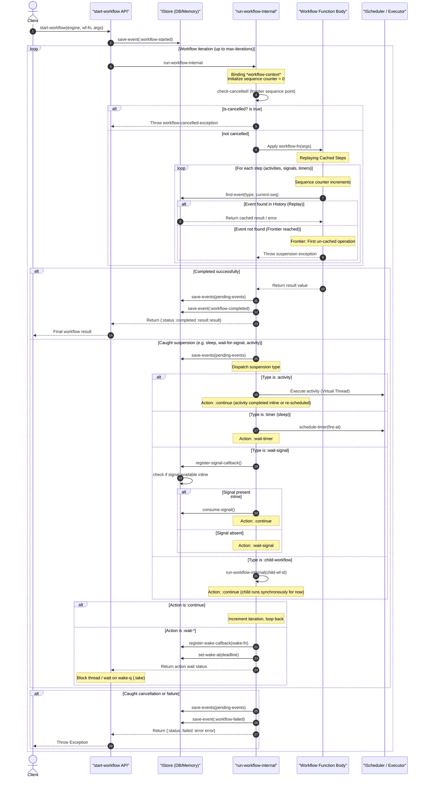
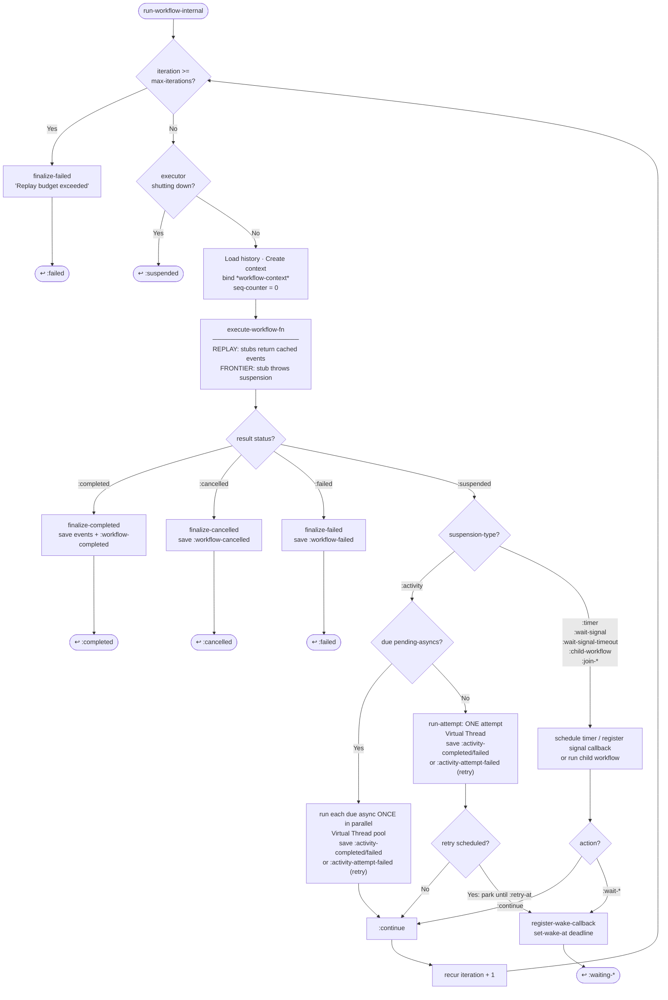

# (in)temporal Architecture & Design Guide

This document describes the high-level architecture of the **intemporal** library, its core lifecycle states, and the internal execution engine logic for workflow management.

---

## 1. High-Level System Architecture

The library is organized into layered components separating persistence, scheduling, activity execution, and workflow orchestration logic:

```mermaid
graph TD
    subgraph Client Application
        W[Workflow Functions]
        A[Activity Functions]
    end

    subgraph Core API Layer [intemporal.core]
        Start[start-workflow / submit-workflow]
        Resume[resume-workflow]
        Stub[stub / stub-protocol]
        Worker[start-worker Poller]
    end

    subgraph Execution Engine [intemporal.internal.execution]
        InternalLoop[run-workflow-internal Loop]
        Ctx[intemporal.internal.context]
        Err[intemporal.internal.error]
    end

    subgraph Platform Abstractions [intemporal.protocol]
        IStore[(IStore Persistence)]
        IExec[IActivityExecutor]
        ISched[IScheduler]
        IObs[IWorkflowObserver]
    end

    subgraph Implementations
        InMemory[InMemoryStore]
        JDBC[JdbcStore Postgres]
        FDB[FDBStore FoundationDB]
        VThread[Virtual Thread Executor]
        Timer[ScheduledExecutorService]
    end

    %% Wiring
    W --> Start
    A --> Stub
    Start --> InternalLoop
    Resume --> InternalLoop
    Worker --> Resume
    InternalLoop --> Ctx
    InternalLoop --> Err
    InternalLoop --> Platform Abstractions
    
    IStore --> InMemory
    IStore --> JDBC
    IStore --> FDB
    IExec --> VThread
    ISched --> Timer
```

### Component Details
* **Core API**: Entry points for starting and resuming workflows. A `Worker` runs a continuous polling loop (`start-worker`) that scans for pending workflows, claims ownership, and resumes them automatically.
* **Orchestration Loop**: `run-workflow-internal` manages execution iterations. It binds dynamic context (`*workflow-context*`) that keeps track of the sequence counter, pending events buffer, and registered protocols.
* **Persistence (`IStore`)**: Event-sourced history log, signal queue, and state variables are kept in a database or in-memory map.
* **Activity Executor & Scheduler**: The runtime executor runs activities (usually on Java 21+ Virtual Threads), while the scheduler manages deferred timer callbacks.

---

## 2. Workflow States

Workflows transition through the following states, which are derived from database flags/columns (`status`, `cancelled`) or by scanning event history:

| State         | Status Keyword | Description                                                                                                  |
|---------------|----------------|--------------------------------------------------------------------------------------------------------------|
| **Not Found** | `:not-found`   | Workflow has not started yet or has no history logs.                                                         |
| **Running**   | `:running`     | Active and executing or suspended waiting for an event/timer.                                                |
| **Completed** | `:completed`   | Terminated successfully. Persists a `:workflow-completed` event.                                             |
| **Failed**    | `:failed`      | Terminated with a runtime failure. Persists a `:workflow-failed` event.                                      |
| **Cancelled** | `:cancelled`   | Terminated via explicit cancel. Sets `cancelled = true` (and currently persists a `:workflow-failed` event). |

### Internal Suspension Wait States
When a workflow is in the `:running` status, it may be suspended waiting for external input. The engine tracks these sub-states to determine if a worker needs to wake the workflow:
* **Timer Wait (`:waiting-timer`)**: Waiting for the clock to reach `fire-at` (timer expiry), or an activity's `:retry-at` — a retry backoff is a suspension, not a sleep on the drive thread, so the attempt counter and the remaining delay both survive a crash and a worker on any pod can take the workflow over when it comes due.
* **Signal Wait (`:waiting-signal`)**: Blocked waiting for a specific signal name to be delivered.
* **Signal Timeout Wait (`:waiting-signal-timeout`)**: Waiting for a signal name, or a clock deadline if the signal doesn't arrive.
* **Async/Join Wait (`:waiting-async`)**: Blocked waiting for parallel async handles to finish execution.

---

## 3. Workflow Execution Flow (`start-workflow`)

The diagram below details the step-by-step lifecycle of `start-workflow` and the internal execution loop in `run-workflow-internal`, including **replay**, **suspension**, **child workflows**, **signals**, and **cancellations**.



## 4. Internal Execution Loop Flowchart (`run-workflow-internal`)



### Detailed Execution Steps
1. **Startup**: The `start-workflow` call registers protocol activities and persists a `:workflow-started` event to history.
2. **Replay Phase**: The engine invokes the workflow function. Each stubbed operation queries the store for existing events matching the current sequence number. If a cached event exists, the result is returned directly, ensuring side-effects are skipped.
3. **Frontier Phase**: When a step is reached that has no corresponding history event, the stub throws a `suspension` exception to abort execution and yield control back to the engine loop.
4. **Suspension Dispatch**: The engine catches the suspension, saves any buffered events (e.g., `:activity-scheduled`), and schedules the required task (e.g., timer, signal callback registration, or activity run).
5. **Resume / Wake**: 
   - When a timer expires or a signal arrives, the database callback or poller fires `wake-fn`, which enqueues a token into a thread-safe `LinkedBlockingQueue` (`wake-q`).
   - The main execution thread wakes up, clears the queue, and triggers the next iteration of the loop, re-running the workflow function from the beginning.
