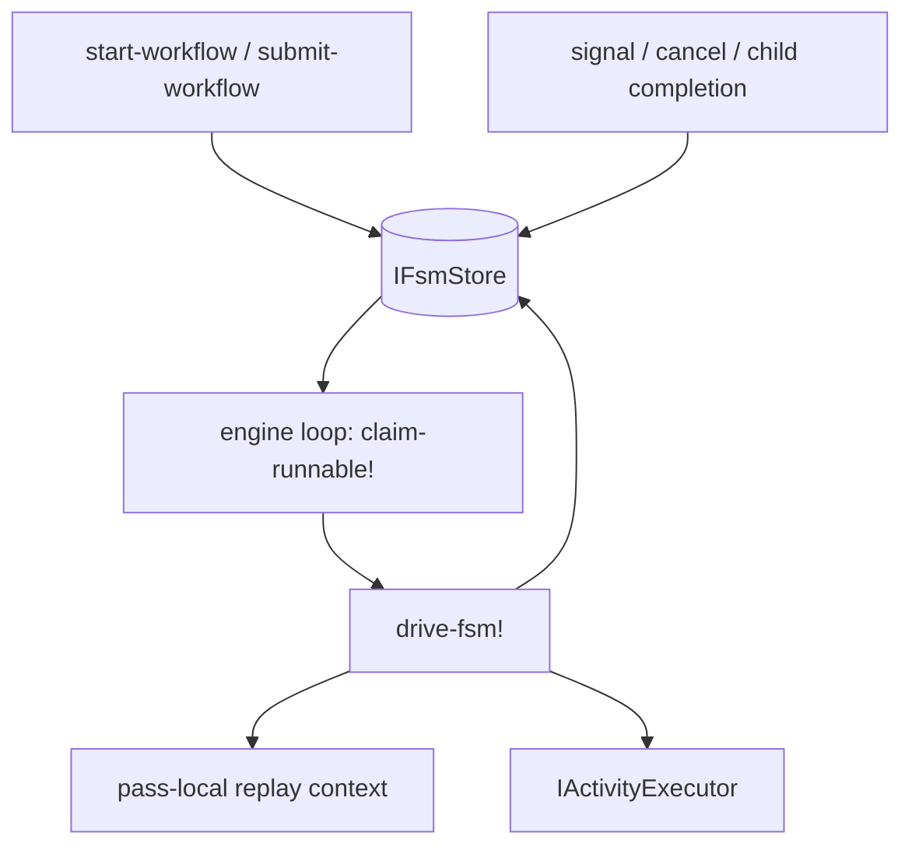
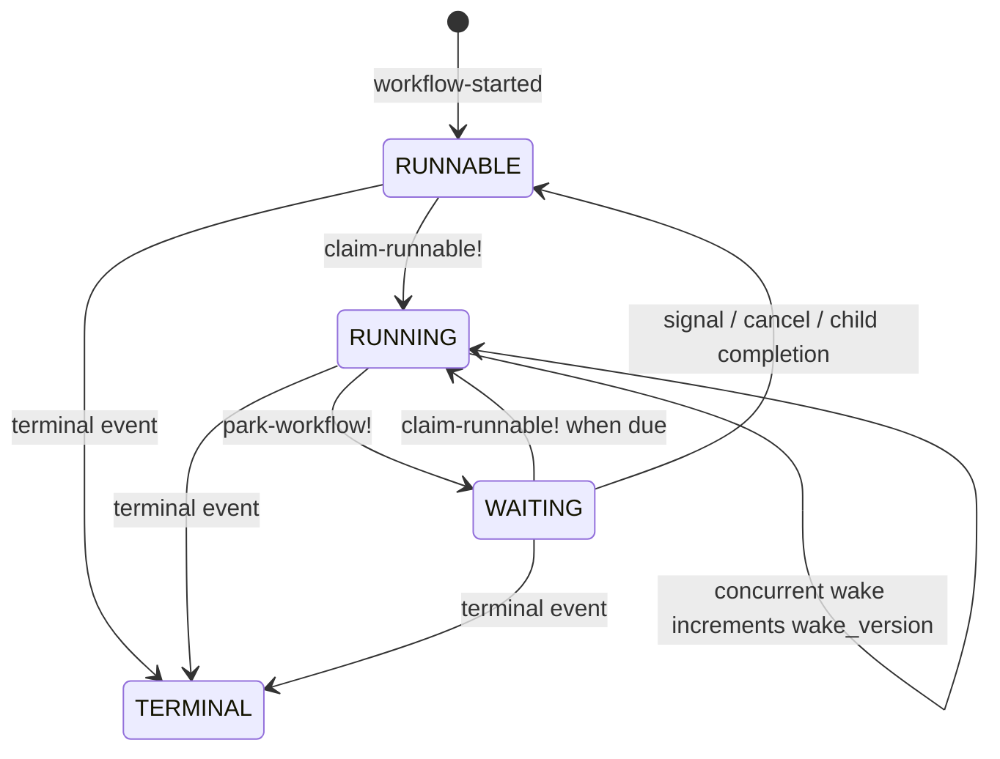
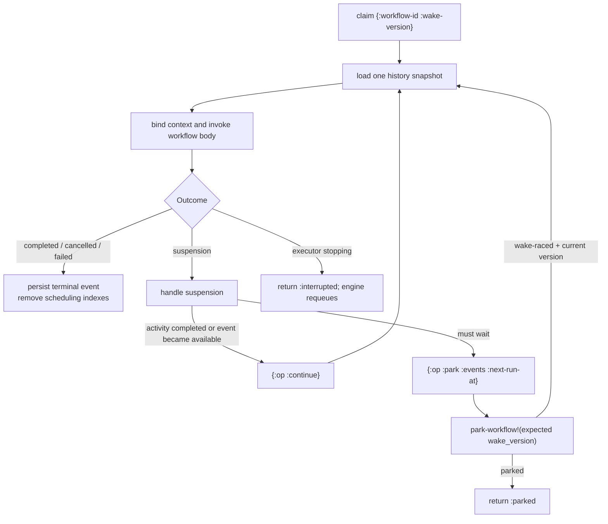

# (in)temporal Architecture & Design Guide

This document describes the durable workflow lifecycle and the execution path used by
intemporal.

## Components



- `intemporal.core` owns submission, the engine, workflow registration, and the public API.
- `intemporal.internal.execution/drive-fsm!` interprets the shared pure reducer
  from a claim returned by the store. Its platform adapter performs storage,
  activity execution, and best-effort observer delivery only for reducer commands.
- `IFsmStore` owns histories, signal queues, ownership, scheduling state, and wake versions.
- `IActivityExecutor` runs side effects. Timers and retry delays are store deadlines, not
  process-local scheduled callbacks.
- `IWorkflowObserver` receives lifecycle notifications.

`start-engine` is an active resource constructor: it registers configured
activities, recovers work for its owner, and starts exactly one bounded engine loop.
`start-workflow` and `submit-workflow` are two waiting styles over that one execution
model. The former submits and awaits a terminal event; the latter returns immediately.
Every engine has an explicit stable owner and drives the workflows it submits.

## Store contract

`IFsmStore` is the atomic persistence boundary. Implementations expose workflow creation,
live state/snapshots, close-tree reads, signal/cancellation/wake inputs, and one guarded
`commit-transition!` operation. A transition is the only way a drive appends workflow
history, consumes a signal, creates a child, parks, emits parent notification, or closes
descendants.

- A snapshot combines immutable ordered history with live owner, scheduling, cancellation,
  revision, wake-version, and FIFO signal-envelope state. Replay only reads this snapshot.
- Event identity is first-write-wins: `[event-type seq nil]`, except retry-attempt events
  include their running `:attempts` count. Sequence is a replay address, not commit time.
- A guarded park compares wake-version and returns `:wake-raced` without consuming input.
  Signal transitions compare the selected FIFO envelope. Close transitions compare every
  related descendant revision. Conflicts reload and replan rather than applying stale work.
- Terminal transitions write the root terminal event, parent completion alias/wake, and all
  selected `:cascade-cancel` / `:terminate` descendant actions atomically. `:abandon`
  stops traversal below that child.
- `claim-runnable!`, recovery, and owner release are engine lifecycle operations. A stable
  owner must name at most one live engine; there are deliberately no leases or fencing.
- `CachedStore` caches histories only by `:history-revision`; metadata and signal inboxes
  are always read live. Checked and cache decorators preserve `AutoCloseable` delegation.

The atomic operations above must not be reconstructed from independent public reads and
writes. JDBC keeps them in one SQL transaction, FDB in one FDB transaction, and the
in-memory store in one atom transition.

## Lifecycle and scheduling state

Public status is deliberately coarser than scheduling state:

| Public status | Meaning |
|---|---|
| `:not-found` | No workflow history exists. |
| `:running` | The workflow is runnable, executing, or waiting. |
| `:completed` | A `:workflow-completed` event is durable. |
| `:failed` | A `:workflow-failed` event is durable. |
| `:cancelled` | Cancellation was requested or a `:workflow-cancelled` event is durable. |
| `:terminated` | A `:workflow-terminated` event is durable. |

The store maintains the scheduling machine independently:



An indefinite signal or join wait has `next-run-at = nil` and no scheduling-index entry.
Timers, signal timeouts, and retries persist their epoch deadline. Consequently engine scans
contain only runnable work and due clocks; the number of indefinite waiters does not affect
poll cost.

## Claimed drive



Each replay pass loads history once and builds a `(seq,event-type)` index. Workflow stubs
read only this snapshot. Completed operations return recorded values; the first operation
without a matching event throws a suspension to identify the deterministic frontier.

Suspension handlers return one of two shapes:

```clojure
{:op :continue}
{:op :park :reason :signal :events [...] :next-run-at nil}
```

Events required before an activity side effect are committed while the workflow remains
`RUNNING`. Events describing the final suspension are passed to `park-workflow!`, which
appends them atomically with `RUNNING -> WAITING`.

## Wake race

Every active workflow has a monotonic `wake_version`.

1. `claim-runnable!` returns the version observed when it changes the workflow to `RUNNING`.
2. A signal, cancellation, or child completion commits its data and wakes atomically.
3. Waking `WAITING` produces `RUNNABLE`; waking `RUNNING` only increments the version.
4. The drive parks with its expected version.
5. If the version is stale, `park-workflow!` appends no suspension events, leaves the row
   `RUNNING`, and returns the current version. The same drive immediately replays.

This prevents both a lost wake and concurrent redispatch.

## Activities, timers, and retries

An activity attempt runs once. Success or terminal failure is recorded before replay
continues. A retryable failure records `:activity-attempt-failed`, including the attempt
number and `:retry-at`, then parks at that deadline. Attempt budgets and delays therefore
survive crashes and do not occupy a drive thread.

Async activities use the same attempt logic in a bounded parallel batch. Joining an
unresolved handle parks; completion events wake the parent durably.

Timers persist `:timer-scheduled` before parking. A due claimed drive records
`:timer-fired`; no local scheduler or timer callback mutates workflow history.

## Child workflows

All children are independent persisted workflows with their own claim and history.
`run-child-workflow-async` returns a handle. `run-child-workflow` is exactly that operation
followed by `join`, so synchronous and asynchronous children share one implementation.

Child terminal persistence atomically appends completion/failure aliases to the parent and
wakes it. Parent close policies are `:terminate`, `:cascade-cancel`, and `:abandon`.

## Engine ownership and shutdown

A running engine owns exactly one scheduling loop. It claims at most its available
`:workflow-concurrency` capacity and executes claims in a bounded pool. Every poll yields,
including empty and capacity-exhausted polls.

Stable owner ids allow `recover-running!` to return same-owner crash leftovers to
`RUNNABLE`. A stable id must identify at most one live process: there are no leases or
fencing tokens yet. Generated `ephemeral-*` ids are suitable for local/in-memory engines,
not cross-process crash recovery. Workflow definitions and protocol implementations must
be loaded at construction, before recovery scans begin.

Controlled shutdown stops claiming, drains or interrupts current work within its grace
period, requeues interrupted nonterminal drives, releases ownership, and then shuts down
the activity executor. On Node, engine poll timers are unreferenced by default so a
forgotten embedded engine does not keep the process alive.

The remaining correctness and scalability boundaries are maintained in
[KNOWN_LIMITATIONS.md](KNOWN_LIMITATIONS.md).
